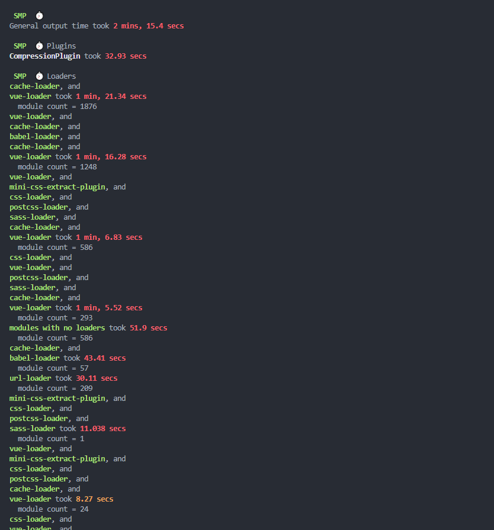
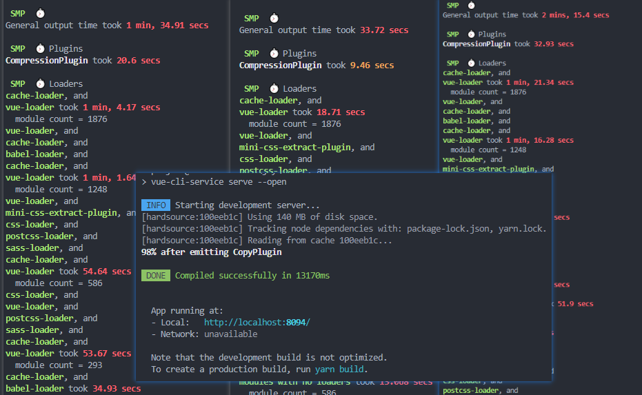

## 前言

公司的后台管理项目是一个持续开发迭代好几年的项目了，随着功能模块的增加，代码的逐渐膨胀，单次项目的启动已经达到了惊人的2min之长。



平时我们前端小伙伴的日常开发状态是这样，打开项目，输入命令：
```npm run serve```,  然后就可以拿起茶杯去倒水，或者起身优哉游哉的去上个厕所了，正可谓合理摸鱼。

于是终于有一天，忍无可忍之下，我决定优化一下这个项目的启动时间。

## 项目分析

首先我们考虑的是哪些导致我们的项目启动耗时过慢，经过一顿搜索，找到了 ```speed-measure-webpack-plugin``` 这个插件。这个插件可以测量你的 webpack 构建速度。

## 安装 speed-measure-webpack-plugin

```shell
npm i speed-measure-webpack-plugin -D
```

然后我们在 vue.config.js 进行相应配置

vue.config.js

```js
const SpeedMeasurePlugin = require("speed-measure-webpack-plugin");
const smp = new SpeedMeasurePlugin({
  outputFormat:"human",
});
module.exports = {
 configureWebpack: smp.wrap({
   plugins: []
 })
}
```

然后再次启动项目，就可以看到项目运行时间分析了：


既然我们已经知道了项目耗时，那么首先想到的是能否利用缓存来提高构建速度。

很巧的是，webpack 正好提供了缓存机制，我们可以在 vue.config.js 中配置缓存机制：


## 2、使用自带的cache配置

```js
  chainWebpack: (config) => {
  config.cache(true)
}
```
对比




## 1、使用 hard-source-webpack-plugin

```shell
cnpm install hard-source-webpack-plugin --save
```

```js
//然后我们在vue.config.js中设置：
const HardSourceWebpackPlugin = require('hard-source-webpack-plugin')
module.exports = {
  configureWebpack: smp.wrap({
    plugins: [
      // 为模块提供中间缓存，缓存路径是：node_modules/.cache/hard-source
      new HardSourceWebpackPlugin(),
      ...
    ]
  })
}


```

>HardSourceWebpackPlugin 和 speed-measure-webpack-plugin 不能一起使用


[参考](https://hellowordjava.blog.csdn.net/article/details/119881095?spm=1001.2101.3001.6650.1&utm_medium=distribute.pc_relevant.none-task-blog-2%7Edefault%7ECTRLIST%7Edefault-1-119881095-blog-117809500.pc_relevant_sortByStrongTime&depth_1-utm_source=distribute.pc_relevant.none-task-blog-2%7Edefault%7ECTRLIST%7Edefault-1-119881095-blog-117809500.pc_relevant_sortByStrongTime&utm_relevant_index=1)、[我是如何把vue项目启动时间从70s优化到7秒的](https://juejin.cn/post/6979879230297341989)、[一行可以让项目启动快70%以上的代码](https://juejin.cn/post/6961203055257714702#comment)