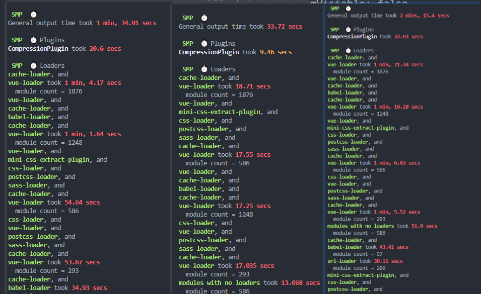

## 安装 speed-measure-webpack-plugin

```shell
npm i speed-measure-webpack-plugin -D
```

vue.config.js

```js
const SpeedMeasurePlugin = require("speed-measure-webpack-plugin");
const smp = new SpeedMeasurePlugin({
  outputFormat:"human",
});
module.exports = {
 configureWebpack: smp.wrap({
   plugins: []
 })
}
```
## 1、使用 hard-source-webpack-plugin

```shell
cnpm install hard-source-webpack-plugin --save
```

```js
//然后我们在vue.config.js中设置：
const HardSourceWebpackPlugin = require('hard-source-webpack-plugin')
module.exports = {
  configureWebpack: smp.wrap({
    plugins: [
      // 为模块提供中间缓存，缓存路径是：node_modules/.cache/hard-source
      new HardSourceWebpackPlugin(),
      new BundleAnalyzerPlugin()
    ]
  })
}


```

>HardSourceWebpackPlugin 和 speed-measure-webpack-plugin 不能一起使用

## 2、使用自带的cache配置

```js
  chainWebpack: (config) => {
  config.cache(true)
}
```
对比



[参考](https://hellowordjava.blog.csdn.net/article/details/119881095?spm=1001.2101.3001.6650.1&utm_medium=distribute.pc_relevant.none-task-blog-2%7Edefault%7ECTRLIST%7Edefault-1-119881095-blog-117809500.pc_relevant_sortByStrongTime&depth_1-utm_source=distribute.pc_relevant.none-task-blog-2%7Edefault%7ECTRLIST%7Edefault-1-119881095-blog-117809500.pc_relevant_sortByStrongTime&utm_relevant_index=1)