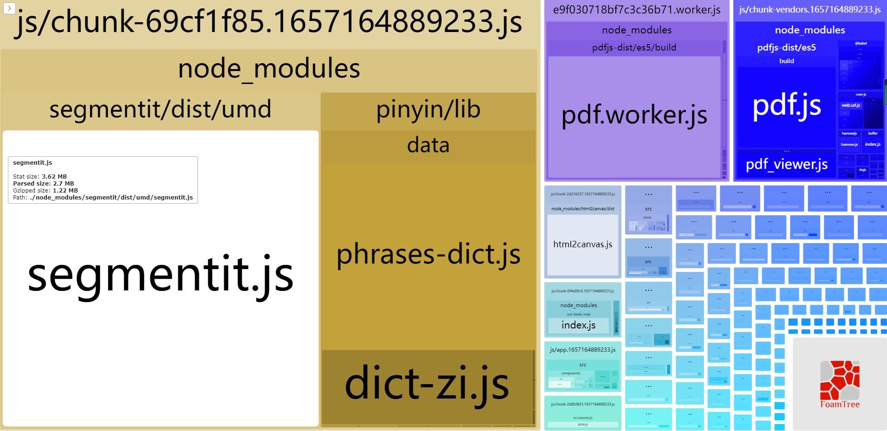
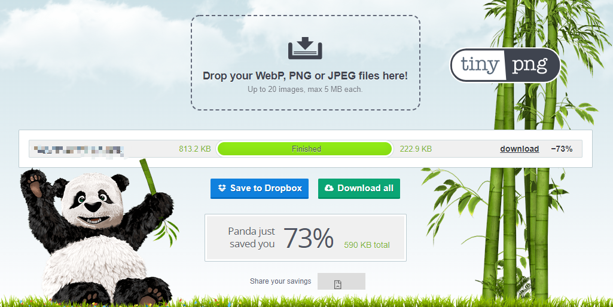
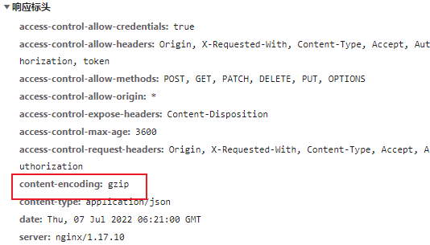

# 关于首屏优化，我做了哪些

前端时间领导突然找到我，说新项目的访问怎么变得这么慢，我立马访问对应页面，果然，首页加载8 9s,这近10s的等待时间，对于用户来说，无疑是痛苦的。于是乎领导就把这个首页加载优化的任务交给我了。

在经过我的一顿折腾后，首屏加载时间基本都在2s左右，这样的首屏加载时间，对于用户来说，算是可以接受的。

因此在此记录一下，针对首屏优化我做了些什么

## 打包分析

在 package.json 中添加命令 ```"report": "vue-cli-service build --report"```

然后命令行执行 ```npm run report```，就会在dist目录下生成一个 report.html 文件，右键浏览器中打开即可看到打包分析报告。



下面我们可以针对报告中的问题逐一进行优化

## 路由懒加载

vue 中使用

```js
component: () => import("views/home/Home.vue"),
```

## vue.config.js  修改 productionSourceMap 为 false

```js
productionSourceMap: false
```

## 首屏请求优化

vue 脚手架默认开启了 preload 与 prefetch，当我们项目很大时，这个就成了首屏加载的最大元凶了

- preload 与 prefetch 都是一种资源预加载机制；
- preload 是预先加载资源，但并不执行，只有需要时才执行它；
- prefetch 是意图预获取一些资源，以备下一个导航/页面使用；
- preload 的优先级高于 prefetch。


```js
//vue.config.js
chainWebpack(config) {
  config.plugins.delete('preload') // 删除默认的preload
  config.plugins.delete('prefetch') // 删除默认的prefetch
}
```

原先项目首页近六百个请求，设置后降到一百左右，减少了http的连接，自然也就减少了首屏加载时间。

配置前：


配置后：


## 图片压缩

有时候 ui 给到的图片资源可能过大，因此我们可以对图片进行压缩，这里推荐常用的在线压缩网站 [tinypng](https://tinypng.com/),可以将图片体积降低至原来的30%左右。而肉眼看起来，图片的清晰度并没有差别。



当然，可以你也可以构建流程中加入压缩图片

使用 image-webpack-loader：

安装
```
npm i image-webpack-loader -D
```

vue.config.js 配置

```js
chainWebpack: config => {
  // 压缩图片
  chainWebpack: (config) => {
    if (isProd) {
      // 图片压缩处理
      const imgRule = config.module.rule('images')
      imgRule
        .test(/\.(png|jpe?g|gif|webp)(\?.*)?$/)
        .use('image-webpack-loader')
        .loader('image-webpack-loader')
        .options({ bypassOnDebug: true })
        .end()
    }
}
```


## 配置使用 CDN 方式引入资源库

```js
//vue.config.js
  configureWebpack: config => {
    config.resolve = {
      // 使用 CDN 的包不用打包到文件中
      externals: {
        // 这里的 element-ui 是 import xx from yy 中的 yy 包名。ELEMENT 则是文件导出的全局变量名字
        'element-ui': 'ELEMENT',
      },
    },
  },
  chainWebpack: config => {
    // 添加 CDN 参数到 htmlWebpackPlugin 配置中
    config.plugin('html').tap(args => {
      args[0].cdn = {
        js: [
          'https://xx.com/CDN/js/index-element-ui@2.13.0.js',
        ],
        css: [
          'https://xx.com/CDN/css/element-ui2.13.0/index.css',
        ],
      };
      return args;
    });
  },
```

**然后在 index.html 中挂载 CDN：**

```js
<!DOCTYPE html>
<html lang="zh">
  <head>
    <% for (var i in htmlWebpackPlugin.options.cdn&&htmlWebpackPlugin.options.cdn.css) { %>
    <link href="<%= htmlWebpackPlugin.options.cdn.css[i] %>" rel="preload" as="style">
    <link href="<%= htmlWebpackPlugin.options.cdn.css[i] %>" rel="stylesheet">
    <% } %>
    <!-- 使用 CDN 加速的 JS 文件，配置在 vue.config.js 下 -->
    <% for (var i in htmlWebpackPlugin.options.cdn&&htmlWebpackPlugin.options.cdn.js) { %>
    <script src="<%= htmlWebpackPlugin.options.cdn.js[i] %>" type="text/javascript"></script>
    <% } %>
  </head>
  <body>
    <div id="app"></div>
  </body>
</html>
```

## 公共代码抽离

```js
  configureWebpack: (config) => {
    // 公共代码抽离
    config.optimization = {
      splitChunks: {
        cacheGroups: {
          libs: {
            name: "chunk-libs",
            test: /[\\/]node_modules[\\/]/,
            priority: 10,
            chunks: "initial", // only package third parties that are initially dependent
          },
          common: {
            chunks: "all",
            test: /[\\/]src[\\/]js[\\/]/,
            name: "common",
            minChunks: 2,
            maxInitialRequests: 5,
            minSize: 0,
            priority: 60,
          },
          styles: {
            name: "styles",
            test: /\.(sa|sc|c)ss$/,
            chunks: "all",
            enforce: true,
          },
          pinyin: {
            // split pinyin libs
            name: "chunk-pinyin",
            test: /[\\/]node_modules[\\/]_?pinyin(.*)/,
            priority: 40,
            chunks: "async",
            reuseExistingChunk: true,
          },
          html2canvas: {
            // split html2canvas libs
            name: "chunk-html2canvas",
            test: /[\\/]node_modules[\\/]_?html2canvas(.*)/,
            priority: 40,
            chunks: "async",
            reuseExistingChunk: true,
          },
          "vue-pdf": {
            // split vue-pdf libs
            name: "chunk-vue-pdf",
            test: /[\\/]node_modules[\\/]_?vue-pdf(.*)/,
            priority: 40,
            chunks: "async",
            reuseExistingChunk: true,
          },
          runtimeChunk: {
            name: "manifest",
          },
        },
      },
    };
```

## 开启 gzip 压缩

安装依赖

```js
npm install compression-webpack-plugin --save-dev
```

```js
//vue.config.js
const CompressionPlugin = require('compression-webpack-plugin');
 
module.exports = {
  configureWebpack: config => {
    config.plugins = [
      ...config.plugins,
      // 开启 gzip 压缩
      new CompressionPlugin({
        filename: '[path][base].gz',
        algorithm: 'gzip',
       test: /\.js$|\.html$|\.css$|\.jpg$|\.jpeg$|\.png/, // 需要压缩的文件类型
        threshold: 10240,
        minRatio: 0.8
      })
    ]
  }
}
```

 nginx 也需要相应进行配置：

 ```
 http {
 
    gzip on; # 开启 gzip 压缩
    gzip_static on; # 若存在静态 gz 文件，则使用该文件
    gzip_min_length 10k; # 设置允许压缩的页面最小字节数
    gzip_buffers 16 8k; # 设置用于处理请求压缩的缓冲区数量和大小
    gzip_comp_level 1; # 设置压缩级别 1-9，数字越大，压缩后的大小越小，也越占用CPU，花费时间越长
	# 对特定的 MIME 类型生效, 其中'text/html’被系统强制启用
    gzip_types application/javascript text/css font/ttf font/x-woff;
    gzip_vary on; # 是否在 http header中 添加 Vary:Accept-Encoding, on | off
    gzip_http_version 1.1; # 在 http/1.1 的协议下不开启压缩
}
```

资源响应头中出现 Content-Encoding: gzip 则代表配置成功



## 其他优化

当然，除了以上所讲到的几种优化手段，还有很多其他的优化方式，比如：

- 白屏加载时的 loading 动画
- 骨架屏
- 小图标把图片替换成 svg
- 路由跳转时的动画

[vue 开发中必备的 cli 配置](https://blog.csdn.net/qq_39025670/article/details/110951945)