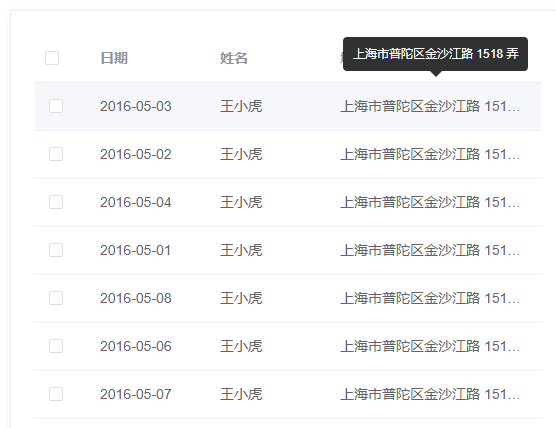

## 前言
经常的，我们在日常工作中，我们会使用第三方UI组件库，比如：element-ui、vant-ui、iview、ant-design等等。不管是为了业务考虑还是单纯的为了提高效率，我们会把一些经常用到组件抽离、封装成公共组件，这样我们就可以在不同的地方使用这个组件，而不需要重复的写一些代码。

当我们在二次封装时，我们在封装什么？

## 二次封装时，我们需要遵循什么？

在 vue 封装时，我们需要注意的主要是三部分：prop、event、slot。

- prop：表示组件接收的参数，最好用对象的写法，这样可以针对每个属性设置类型、默认值或自定义校验属性的值，此外还可以通过type、validator等方式对输入进行验证；
- event：子组件向父组件传递消息的重要途径；
- slot：可以给组件动态插入一些内容或组件，是实现高阶组件的重要途径；当需要多个插槽时，可以使用具名slot。


## 你必须要知道的 $attrs 和 $listeners

多级组件嵌套需要传递数据时，通常使用的方法是通过vuex。如果仅仅是传递数据，而不做中间处理，使用 vuex 处理，这就有点大材小用了。所以就有了 $attrs / $listeners ，通常配合 inheritAttrs 一起使用。

感觉还是挺晦涩难懂的，简单的说就是 inheritAttrs：true 继承除props之外的所有属性；inheritAttrs：false 只继承class属性。

- $attrs:包含了父作用域中不被认为 (且不预期为) props 的特性绑定 (class 和 style 除外)，并且可以通过 ```v-bind="$attrs"``` 传入内部组件。当一个组件没有声明任何 props 时，它包含所有父作用域的绑定 (class 和 style 除外)。
- $listeners:包含了父作用域中的 (不含 .native 修饰符) v-on 事件监听器。它可以通过 ```v-on="$listeners"``` 传入内部组件。它是一个对象，里面包含了作用在这个组件上的所有事件监听器，相当于子组件继承了父组件的事件。

$attrs 和 $listeners 在创建高级别的组件时非常有用。


### 如何使用

上面说了那么多，我们来看一个例子：

我们在使用


经常的我们在进行内容展示时。有一段文字，我们希望在文字溢出时，显示省略号，然后鼠标移入文字提示，展示全部文字。不溢出时，不做任何处理，既没有文字提示的效果。

对的，你和容易想到，这不就是 el-table 的show-overflow-tooltip 功能吗



但是我们现在不是在表格内，所以无法直接使用这个功能。这个时候我们很容易想到用 el-tooltip 时，但是查看 element 的示例我们会发现一个问题，因为我们的内容是不确定的，就是说我们不确定内容文字是否溢出，如果直接使用组件的话，无论是否溢出，都会tooltip显示全部文字，而这与我们的需求是违背。

那么我们该怎样才能做到，开发中很多地方我们可能都需要用到这个组件，考虑到易用性、复用性，也为了方便我们后续的维护，我们决定把```el-tooltip``` 二次封装成一个公共组件

话不多说，现在开干

参照element的示例，我们很容易写出：

```vue
<template>
  <el-tooltip  :content="content">
    <span>{{content}}</span>
  </el-tooltip>
</template>

<script>
export default {
  name: 'CzEllipsisTooltip',
  props: {
    content: { type: String, default: '' },
  },
}
</script>
```

显然，这是不符合我们的需求的，我们想要的是，当文字溢出时，显示省略号，鼠标移入文字提示，展示全部文字。

我们加上亿点点判断逻辑：

```vue
<template>
  <el-tooltip :content="content" :disabled="disableTip" >
    <div class="ellipsis" @mouseover="onMouseOver" :style="{color:color}">
      <span ref="ellipsis" :style="{color,fontSize,fontWeight}">{{content}}</span>
    </div>
  </el-tooltip>
</template>

<script>
export default {
  name: 'CzEllipsisTooltip',
  props: {
    content: { type: String, default: '' },
    color: String,
    fontSize: {
      type: String,
      default: '14px'
    },
    fontWeight: {
      type: [String, Number],
      default: 'normal'
    }

  },
  data() {
    return {
      disableTip: false
    }
  },
  methods: {
    onMouseOver() {
      const parentWidth = this.$refs['ellipsis'].parentNode.offsetWidth
      const contentWidth = this.$refs['ellipsis'].offsetWidth
      this.disableTip = contentWidth <= parentWidth
    }
  }
}
</script>

<style scoped lang="scss">
.ellipsis {
  width: 100%;
  overflow: hidden;
  white-space: nowrap;
  content-overflow: ellipsis;
}
</style>
```
好了，经过我们一番改造后，我们的组件就可以满足我们的需求了，但是这样又有一个问题，el-tooltip 组件自带那么多属性，例如我们想把主题 effect 设置成默认 light ，当然，你可以在 props中添加一个定义，设置默认值，但是组件其他自带的


[参考](https://juejin.cn/post/7087728529512759332)、[如何优雅的二次封装element组件](https://juejin.cn/post/6975725959492157477)、[二次封装这几个 element-ui 组件后，让代码更加优雅了](https://segmentfault.com/a/1190000041757434?sort=newest)