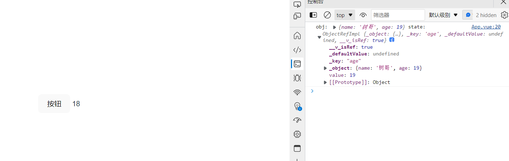
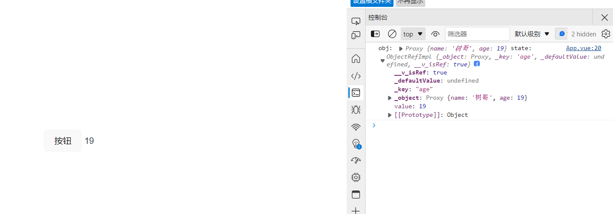
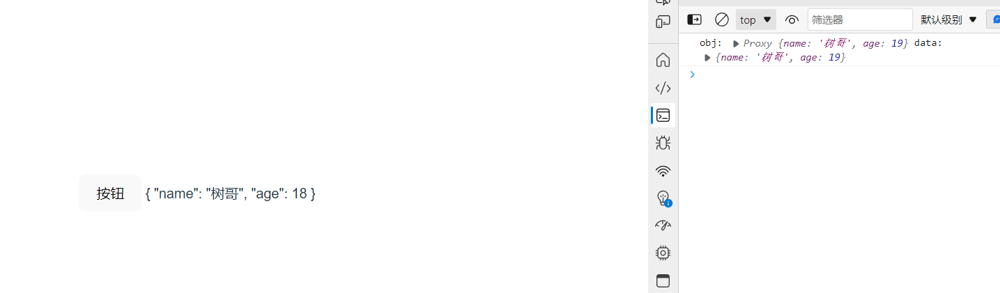

## 环境搭建

```sh
npm init vue@latest
```

## 使用工具

``` <script setup lang="ts"> + VSCode + Volar```

>安装 Volar 后，注意禁用 vetur

## ref 和 reactive

- ref: 用来给基本数据类型绑定响应式数据，访问时需要通过 .value 的形式， tamplate 会自动解析,不需要 .value
-  reactive: 用来给 复杂数据类型 绑定响应式数据，直接访问即可

>ref其实也是内部调用来reactive实现的


```vue
<template>
  <div>
    <p>{{title}}</p>
    <h4>{{userInfo}}</h4>
  </div>
</template>

<script setup lang="ts">
import { ref, reactive } from "vue";
type Person = {
    name: string;
    age: number;
    gender?: string;
};
const title = ref<string>("彼时彼刻，恰如此时此刻");
const userInfo = reactive<Person>({
  name: '树哥',
  age: 18
})
</script>
```

## 计算属性与监听器

### 计算属性

```vue
<template>
  <div>
    <p>{{title}}</p>
    <h4>{{userInfo}}</h4>
    <h1>{{add}}</h1>
  </div>
</template>

<script setup lang="ts">
import { ref, reactive,computed } from "vue";
const count = ref(0)

// 推导得到的类型：ComputedRef<number>
const add = computed(() => count.value +1)

</script>
```

## toRef、toRefs、toRaw

### toRef

toRef 如果原始对象是非响应式的,数据会变,但不会更新视图

```vue
<template>
  <div>
     <button @click="change">按钮</button>
     {{state}}
  </div>
</template>

<script setup lang="ts">
import { reactive, toRef } from 'vue'

const obj = {
  name: '树哥',
  age: 18
}

const state = toRef(obj, 'age')

const change = () => {
  state.value++
  console.log('obj:',obj,'state:', state);
}
</script>
```



可以看到，点击按钮，当原始对象是非响应式时，使用toRef 的数据改变，但是试图并没有更新

```vue
<template>
  <div>
    <button @click="change">按钮</button>
    {{state}}
  </div>
</template>

<script setup lang="ts">
import { reactive, toRef } from 'vue'

const obj = reactive({
  name: '树哥',
  age: 18
})

const state = toRef(obj, 'age')

const change = () => {
  state.value++
  console.log('obj:', obj, 'state:', state);
}
</script>
```



当我们把 obj 用 reactive 包裹，再使用 toRef，点击按钮时，可以看到视图和数据都变了

>toRef返回的值是否具有响应性取决于被解构的对象本身是否具有响应性。响应式数据经过toRef返回的值仍具有响应性，非响应式数据经过toRef返回的值仍没有响应性。


### toRefs

toRefs相当于对对象内每个属性调用toRef，toRefs返回的对象内的属性使用时需要加.value,主要是方便我们解构使用

```vue
<template>
  <div>
    <button @click="change">按钮</button>
    name--{{name}}---age{{age}}
  </div>
</template>

<script setup lang="ts">
import { reactive, toRefs } from 'vue'

const obj = reactive({
  name: '树哥',
  age: 18
})

let { name, age } = toRefs(obj)

const change = () => {
  age.value++
  name.value = '张麻子'
  console.log('obj:', obj);
  console.log('name:', name);
  console.log('age:', age);
}
</script>
```

简单理解就是批量版的toRef,(**其源码实现也正是通过对象循环调用了toRef**)

## toRaw

将响应式对象修改为普通对象

```vue
<template>
  <div>
    <button @click="change">按钮</button>
    {{data}}
  </div>
</template>

<script setup lang="ts">
import { reactive, toRaw } from 'vue'

const obj = reactive({
  name: '树哥',
  age: 18
})

const data = toRaw(obj)

const change = () => {
  data.age = 19
  console.log('obj:', obj, 'data:', data);
}
</script>
```



数据能变化，视图不变化(失去响应式)

## watch


>注意：defineProps 、defineEmits 、 defineExpose 和 withDefaults 这四个宏函数只能在 ```<script setup>``` 中使用。他们不需要导入，会随着``` <script setup> ```的处理过程中一起被编译。

[Vue3使用TypeScript的正确姿势](https://blog.csdn.net/lgno2/article/details/109446711)

[dynamic-theme-demos](https://github.com/GitOfZGT/dynamic-theme-demos)